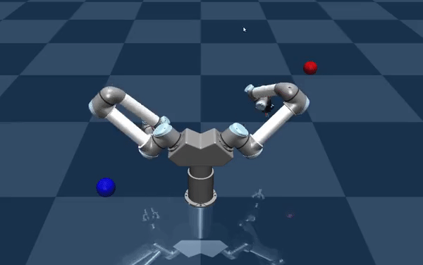

## IRL Control

IRL Control is a simulation and control framework for bimanual robot manipulation developed at the Interactive Robotics Lab at Arizona State University. The framework provides a variety of features and algorithms for implementing and learning of bimanual control policies. In particular, it provides easy access to functions for collecting training data from input devices, generating low-level robot control signals, for visualization and debugging, as well as the evaluation of generated robot controllers. IRL Control uses MuJoCo as a simulation backbone to generate physically-correct simulations of the interactions between the robot, its environment, and manipulated objects. 

## Capabilities
- Operational Space Control
- Admittance Control for handling external forces to the robot
- Rapid development of demos with a dual-arm UR5 robot through inheritance
- Support for PS Move controllers and 3D Connexion Space Mouse to teleoperate the robot arms
- Supports easy addition of controlled devices to the scene (handles Jacobians, forces, joint states, etc)
- YAML configuration files for setting the PID Gains, Min/Max velocities, and kinematic descriptions of the robot's controlled devices
- Male/Female adapters with low-tolerance for performing insertion tasks (with convex decompositions from V-HACD)

## Examples

### Insertion Task
<!-- | | |
|-|-|
|   |   | -->
In [this example](irl_control/examples/insertion_task.py), the Dual UR5 Robot inserts adapters into their corresponding slot, with each component spawned at a randomly generated angle and position. The robot must precisely align and insert the components under small tolerance contraints. Here, the robot executes a sequence of actions defined by the [insertion action sequence](irl_control/action_sequence_configs/insertion_task.yaml). This action sequence defines a generic algorithm that can be executed on either arm, as well as: how much force the gripper should apply at each stage of the task, the velocity constraints, and the objects involved in the action (containing information on the proper location and orientation for picking/inserting).

 

### PS Move Teleoperation
In [this example](irl_control/examples/ps_move_example.py), the user teleoperates the robot for picking up objects in the scene. The PS Move controllers allow for opening and closing the gripper and controlling the desired position of the end effector, which the robot moves to when the trigger is pressed. The controllers have a one-to-one correspondance with each robot arm, so that it is possible to extend this example to more complex (and jointly controlled) bi-manual manipulation tasks.

### PID Gain Test
The objective for [this example](irl_control/examples/gain_test.py) is to evaluate PID gains to ensure that the base stand and a desired arm (the arm on the left in this case) are stable under high torques. It can be seen that the arm on the right is vigorously moving back-and-forth in order to apply a high torque to the rest of the robot's body. Notably, the base joint and left arm are stable under these forces, reinforcing the notion that the chosen gains are adequate for tasks which require an arm to be steady under high external forces. 

